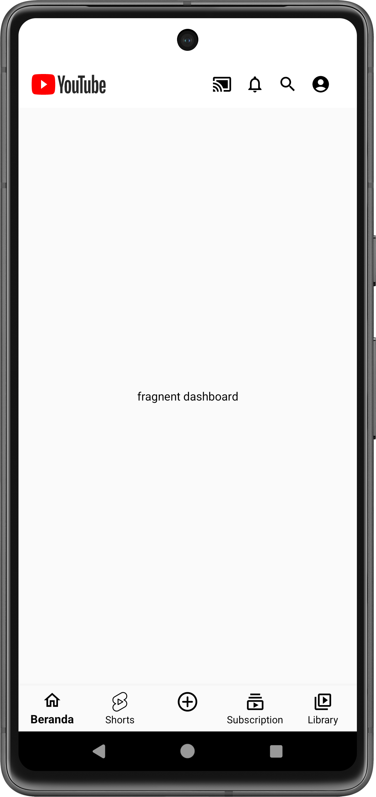
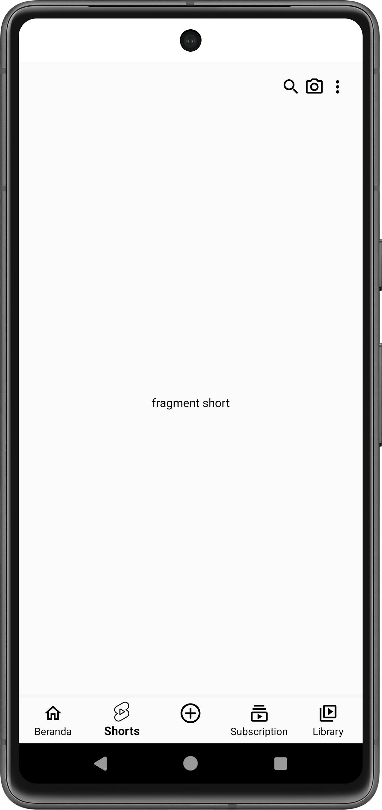
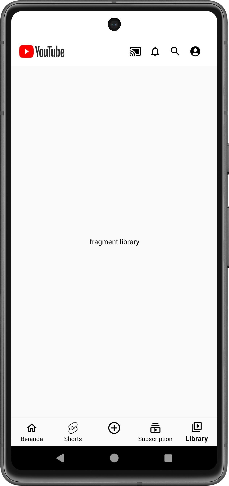
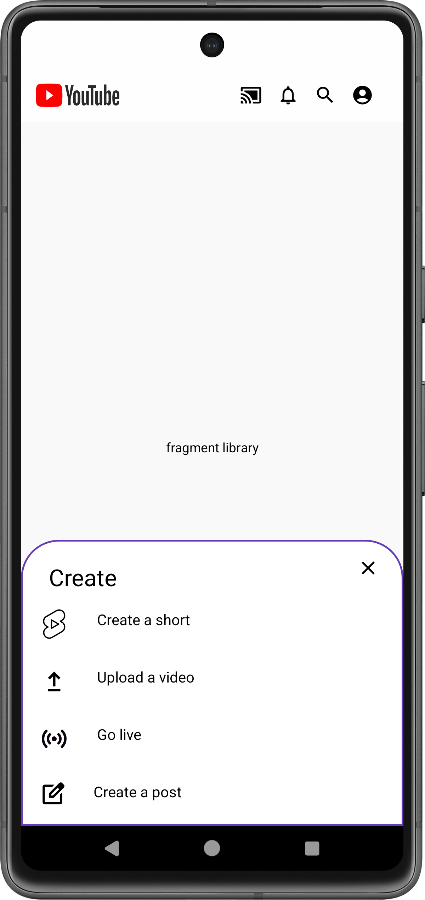

# PAM-NavigationProject-YouTube

# Member List

| Nama | NIM |
|---|---|
| Muhammad Rihap Firdaus | 1217050102 |
| Ridwan Ahmad Fauzan | 1217050121 |
| Sami Irhamnillah | 1217050131 |
| Wildan Sophal Jamil | 1217050142 |
| Yuda Risian Asgari | 1217050146 |

# Pengenalan Descendant, Ancestral, dan Lateral Nav

Descendant, ancestral, dan lateral nav adalah tiga jenis navigasi yang umum digunakan dalam aplikasi mobile dan web.

* **Descendant navigation** memungkinkan pengguna untuk menavigasi ke bawah dari layar induk ke layar anak.
* **Ancestral navigation** memungkinkan pengguna untuk menavigasi ke atas dari layar anak ke layar induk.
* **Lateral navigation** memungkinkan pengguna untuk menavigasi di antara layar saudara yang berada di tingkat yang sama dalam hierarki.

Ketiga jenis navigasi ini dapat digunakan bersama-sama untuk menciptakan pengalaman pengguna yang efisien dan intuitif.

Berikut adalah beberapa contoh aplikasi yang menggunakan lateral navigation:

* Tokopedia
* Shopee
* YouTube
* Instagram
* TikTok

# Proyek Clone Tampilan YouTube

Kami sedang membuat projek clone tampilan aplikasi YouTube, tetapi hanya pada bar navigationnya saja. Di dalam bar navigationnya, terdapat tampilan home page, YouTube Short, library, add post. Projek ini menggunakan bahasa pemrograman Kotlin.

Berikut adalah penjelasan lebih rinci tentang projek kita:

* **Tampilan home page**

 akan menampilkan video-video terbaru yang sedang populer. Navigasi Atas ada 5 icon yaitu logo youtube,icon menyambungkan ke TV,icon lonceng (pemberitahuan/notif),icon search,dan profil.Navigasi Bawah terdapat 5 icon diantaranya,icon beranda,short.icon add/upload video,subsciption,dan library
* **Tampilan YouTube Short**  akan menampilkan video-video pendek yang berdurasi maksimal 1 menit. Heading bar terdapat icon search,kamera dan titik 3
* **Tampilan library**

 akan menampilkan daftar video yang telah ditonton pengguna.Navbar Atas ada 5 icon yaitu logo youtube,icon menyambungkan ke TV,icon lonceng (pemberitahuan/notif),icon search,dan profil.
* **Tampilan add post** 

akan memungkinkan pengguna untuk mengunggah video baru.Fragment Add
* **Tampilan open app** akan membuka aplikasi YouTube asli.

Kami menggunakan bahasa pemrograman Kotlin karena Kotlin adalah bahasa pemrograman yang modern dan efisien. Kotlin juga memiliki dukungan yang baik untuk pengembangan aplikasi Android.

Semoga penjelasan kami dapat membantu Anda memahami projek kami.
